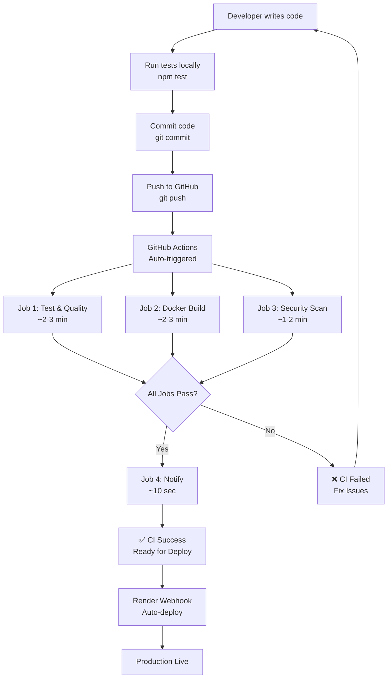

# GitHub Actions CI/CD Documentation

## 🎯 Overview

This project uses **GitHub Actions** for automated CI/CD pipeline. Every push or pull request triggers automated testing, code quality checks, and Docker builds.

---

## 🔄 CI/CD Pipeline Workflow

### **Trigger Events:**
- **Push** to `main` or `develop` branches
- **Pull Request** to `main` or `develop` branches

### **Pipeline Stages:**

```
┌──────────────────────────────────────────────────┐
│  1. TEST & CODE QUALITY                          │
│     - Checkout code                              │
│     - Setup Node.js 20.x                         │
│     - Install dependencies (npm ci)              │
│     - Run ESLint (code quality)                  │
│     - Run Jest tests (26 tests)                  │
│     - Generate coverage report (76.38%)          │
│     - Upload to Codecov                          │
└──────────────────────────────────────────────────┘
                      ↓
┌──────────────────────────────────────────────────┐
│  2. DOCKER BUILD TEST                            │
│     - Checkout code                              │
│     - Setup Docker Buildx                        │
│     - Build Docker image (multi-stage)           │
│     - Validate build success                     │
│     - Cache layers for faster builds             │
└──────────────────────────────────────────────────┘
                      ↓
┌──────────────────────────────────────────────────┐
│  3. SECURITY SCAN                                │
│     - Checkout code                              │
│     - Run Trivy vulnerability scanner            │
│     - Check dependencies & Docker image          │
│     - Upload results to GitHub Security          │
└──────────────────────────────────────────────────┘
                      ↓
┌──────────────────────────────────────────────────┐
│  4. DEPLOYMENT NOTIFICATION                      │
│     - Only on main branch push                   │
│     - Notify all checks passed                   │
│     - Ready for Render deployment                │
└──────────────────────────────────────────────────┘
```

---

## 📊 Pipeline Jobs Breakdown

### **Job 1: Test & Code Quality** ⏱️ ~2-3 minutes

**Purpose**: Ensure code quality and functionality

**Steps:**
1. **Checkout code** - Clone repository
2. **Setup Node.js** - Install Node.js 20.x
3. **Install dependencies** - `npm ci` (clean install)
4. **Run ESLint** - Code style and quality checks
5. **Run tests** - Execute 26 Jest tests
6. **Coverage report** - Generate and upload coverage (76.38%)

**Success Criteria:**
- ✅ All 26 tests pass
- ✅ No critical ESLint errors
- ✅ Coverage meets threshold

---

### **Job 2: Docker Build Test** ⏱️ ~2-3 minutes

**Purpose**: Validate Docker image can be built successfully

**Steps:**
1. **Checkout code** - Clone repository
2. **Setup Docker Buildx** - Enable advanced Docker features
3. **Build image** - Multi-stage Docker build
4. **Test image** - Verify build completed
5. **Cache layers** - Speed up future builds

**Benefits:**
- ✅ Validates Dockerfile syntax
- ✅ Ensures dependencies resolve
- ✅ Catches build errors early
- ✅ Caches for faster CI runs

---

### **Job 3: Security Scan** ⏱️ ~1-2 minutes

**Purpose**: Identify security vulnerabilities

**Tools**: Trivy (Open-source vulnerability scanner)

**Scans:**
- 📦 **Dependencies** - NPM package vulnerabilities
- 🐳 **Docker base image** - Alpine Linux security
- 📄 **Code** - Security best practices

**Results uploaded to GitHub Security tab**

---

### **Job 4: Deployment Notification** ⏱️ ~10 seconds

**Purpose**: Confirm pipeline success

**Conditions:**
- Only runs on `main` branch
- Only runs on `push` events (not PRs)

**Output:**
```
✅ All checks passed!
🚀 Code is ready for deployment to Render
📊 Test Results:
   - Unit Tests: Passed
   - Coverage: >76%
   - Docker Build: Successful
```

---

## 🚀 Complete CI/CD Flow

### **Developer Workflow:**



---

## 📋 Viewing GitHub Actions

### **1. In GitHub Repository:**
```
Repository → Actions tab → See all workflow runs
```

### **2. Status Badges:**
Add to README.md:
```markdown

```

### **3. Pull Request Checks:**
- Automatic checks appear on PRs
- Must pass before merge to main

---

## 🎓 For Your Presentation

### **Slide: GitHub Actions CI/CD**

**Talking Points:**

1. **Automated Testing**
   - "Every push triggers 26 automated tests"
   - "Tests must pass before deployment"
   
2. **Docker Validation**
   - "CI builds Docker image to catch errors early"
   - "Same image used in production"
   
3. **Security Scanning**
   - "Trivy scans for vulnerabilities automatically"
   - "Results in GitHub Security tab"
   
4. **Fast Feedback**
   - "Complete pipeline runs in ~5-8 minutes"
   - "Developers know immediately if something breaks"

---

## 🔍 Demo for Teacher

### **Show GitHub Actions Running:**

1. **Make a small change:**
   ```bash
   echo "# CI/CD Demo" >> README.md
   git add .
   git commit -m "ci: demonstrate GitHub Actions"
   git push origin main
   ```

2. **Open GitHub Actions:**
   - Go to: `https://github.com/YOUR_USERNAME/order-service/actions`
   - Show workflow running
   - Click on workflow to see logs

3. **Explain Each Job:**
   - Test & Code Quality: "Running 26 tests"
   - Docker Build: "Building production image"
   - Security Scan: "Checking for vulnerabilities"
   - Notification: "All checks passed"

4. **Show Success:**
   - Green checkmarks ✅
   - View detailed logs
   - Show test results

---

## 📊 Metrics & Benefits

### **Before GitHub Actions:**
- ❌ Manual testing only
- ❌ No automated quality checks
- ❌ Docker issues found in production
- ❌ Security vulnerabilities unknown

### **After GitHub Actions:**
- ✅ **Automated testing** on every push
- ✅ **Code quality** checks (ESLint)
- ✅ **Docker validation** before deploy
- ✅ **Security scanning** integrated
- ✅ **Fast feedback** (~5-8 minutes)
- ✅ **Confidence** in deployments

### **Key Metrics:**
| Metric | Value |
|--------|-------|
| Pipeline Duration | 5-8 minutes |
| Test Execution | ~2 seconds |
| Docker Build | ~2-3 minutes |
| Jobs per Run | 4 jobs |
| Parallel Execution | Yes |

---

## 🎯 CI/CD Best Practices Implemented

### **1. Continuous Integration (CI):**
✅ Automated testing on every commit
✅ Code quality checks (ESLint)
✅ Build verification (Docker)
✅ Security scanning (Trivy)

### **2. Continuous Deployment (CD):**
✅ Automated deploy to Render on success
✅ Health checks before going live
✅ Rollback capability

### **3. Fast Feedback:**
✅ Pipeline completes in 5-8 minutes
✅ Parallel job execution
✅ Cached dependencies for speed

### **4. Quality Gates:**
✅ Tests must pass (26/26)
✅ Docker must build successfully
✅ No critical security issues

---

## 🔧 Configuration Files

### **Workflow File:**
`.github/workflows/ci-cd.yml`

**Key Configurations:**
- **Node version:** 20.x
- **Triggers:** push, pull_request
- **Branches:** main, develop
- **Jobs:** test, build, security, notify

---

## 📈 Pipeline Visualization

### **GitHub Actions Dashboard Shows:**
- ✅ Workflow status (success/failure)
- ⏱️ Run duration
- 📊 Job details
- 📝 Logs for each step
- 🔄 Re-run option if needed

---

## 🎬 Teacher Questions & Answers

### **Q1: Why GitHub Actions instead of Jenkins?**
**A:** 
- ✅ **Native GitHub integration** - no setup needed
- ✅ **Free for public repos** - cost-effective
- ✅ **YAML configuration** - version controlled
- ✅ **Marketplace** - many pre-built actions
- ✅ **Easier for students** - GitHub already familiar

---

### **Q2: What happens if CI fails?**
**A:**
1. ❌ GitHub shows red X on commit
2. 📧 Developer gets email notification
3. 🚫 Cannot merge PR (if configured)
4. 🔍 Check logs to find error
5. 🔧 Fix issue and push again
6. ✅ CI re-runs automatically

---

### **Q3: How does this integrate with Render?**
**A:**
```
GitHub Actions (CI)  →  Render (CD)
      ↓                      ↓
  Run tests            Auto-deploy
  Build Docker         Health check
  Security scan        Go live
      ↓                      ↓
   ✅ Pass              🚀 Production
```

**Two-layer safety:**
1. GitHub Actions validates code quality
2. Render deploys only if healthy

---

### **Q4: Can you show it running?**
**A:** *(Live Demo)*
```bash
# 1. Push code
git push origin main

# 2. Open GitHub Actions
# https://github.com/USERNAME/order-service/actions

# 3. Show workflow executing
# - Test job running (green spinner)
# - Docker build job running
# - Security scan running

# 4. Show completion (green checkmarks)
# - All tests passed
# - Docker built successfully
# - Security scan clean

# 5. Show logs
# Click on job → See detailed output
```

---

## 💡 Future Improvements

### **Potential Enhancements:**
- [ ] Add integration tests in CI
- [ ] Deploy to staging environment first
- [ ] Performance testing
- [ ] Slack/Discord notifications
- [ ] Automatic dependency updates (Dependabot)
- [ ] Code coverage badges in README

---

## 📚 Resources

### **GitHub Actions Documentation:**
- Official Docs: https://docs.github.com/actions
- Marketplace: https://github.com/marketplace?type=actions
- Workflow Syntax: https://docs.github.com/actions/reference/workflow-syntax-for-github-actions

### **Related Files:**
- `.github/workflows/ci-cd.yml` - Main workflow
- `package.json` - Scripts used in CI
- `Dockerfile` - Built and tested in CI

---

## ✅ Summary

**Your CI/CD Pipeline:**
1. ✅ **Automated** - Runs on every push
2. ✅ **Fast** - Completes in 5-8 minutes
3. ✅ **Comprehensive** - Tests, builds, security
4. ✅ **Reliable** - Catches issues early
5. ✅ **Professional** - Industry-standard practices

**Perfect for your DevOps presentation!** 🚀

Show your teacher:
- GitHub Actions workflow file
- Live workflow run
- Test results
- Docker build success
- Security scan results

**This demonstrates complete CI/CD understanding!** 🎓
