# Order Service - Presentation Slides

## 🎯 Slide 1: Technology Stack

### **Backend Framework**
- **NestJS v11.x** - Progressive Node.js framework
- **TypeScript** - Type-safe development
- **Node.js v20** - JavaScript runtime

### **Database**
- **PostgreSQL v15** - Relational database
- **TypeORM** - ORM for database operations
- **Automated migrations** - Schema management

### **Testing Framework**
- **Jest v30** - Unit & integration testing
- **ts-jest** - TypeScript support
- **@nestjs/testing** - Testing utilities
- **26 tests** with **76.38% coverage**

### **API & Integration**
- **REST API** - RESTful endpoints
- **Axios** - HTTP client for external APIs
- **API Gateway** - Centralized routing
- **Microservices Architecture**

### **Containerization**
- **Docker** - Container platform
- **Multi-stage builds** - Optimized images
- **Alpine Linux** - Minimal base image

### **DevOps & Deployment**
- **GitHub** - Version control & CI/CD
- **Render** - Cloud platform
- **Docker Compose** - Local orchestration
- **Automated deployments** - Push to deploy

### **Validation & Security**
- **class-validator** - DTO validation
- **class-transformer** - Data transformation
- **Environment variables** - Configuration management



```mermaid
flowchart TB

%% ======================
%% Backend Framework
%% ======================
subgraph Backend["🧠 Backend Framework"]
    NEST[NestJS v11 🚀<br/>Progressive Node.js Framework]
    TS[TypeScript 🟦<br/>Type-safe Development]
    NODE[Node.js v20 🟢<br/>JavaScript Runtime]
end

%% ======================
%% Database
%% ======================
subgraph Database["🗄️ Database"]
    PG[PostgreSQL v15 🐘<br/>Relational Database]
    TYPEORM[TypeORM 🔄<br/>ORM Operations]
    MIGRATION[Automated Migrations ⚙️<br/>Schema Management]
end

%% ======================
%% Testing
%% ======================
subgraph Testing["🧪 Testing Framework"]
    JEST[Jest v30 🧪<br/>Unit & Integration Testing]
    TSJEST[ts-jest 🔷<br/>TypeScript Support]
    NESTTEST[NestJS Testing 🧩<br/>Testing Utilities]
    COVERAGE[76.38% Coverage 📊<br/>26 Tests]
end

%% ======================
%% API & Integration
%% ======================
subgraph API["🌐 API & Integration"]
    REST[REST API 🔁<br/>RESTful Endpoints]
    AXIOS[Axios 🔗<br/>HTTP Client]
    GATEWAY[API Gateway 🚦<br/>Centralized Routing]
    MICRO[Microservices 🧩<br/>Scalable Architecture]
end

%% ======================
%% Containerization
%% ======================
subgraph Container["📦 Containerization"]
    DOCKER[Docker 🐳<br/>Container Platform]
    MULTI[Multi-stage Builds 🏗️<br/>Optimized Images]
    ALPINE[Alpine Linux 🪶<br/>Lightweight Base Image]
end

%% ======================
%% DevOps & Deployment
%% ======================
subgraph DevOps["🚀 DevOps & Deployment"]
    GITHUB[GitHub 🐙<br/>Version Control & CI/CD]
    RENDER[Render ☁️<br/>Cloud Platform]
    COMPOSE[Docker Compose 🧩<br/>Local Orchestration]
    AUTO[Auto Deploy ⚡<br/>Push to Deploy]
end

%% ======================
%% Security & Validation
%% ======================
subgraph Security["🔐 Validation & Security"]
    VALIDATOR[Class Validator ✅<br/>DTO Validation]
    TRANSFORMER[Class Transformer 🔄<br/>Data Transformation]
    ENV[Environment Variables 🔑<br/>Config Management]
end

%% ======================
%% Connections
%% ======================
Backend --> Database
Backend --> Testing
Backend --> API
API --> Container
Container --> DevOps
DevOps --> Security

%% Styling
classDef backend fill:#4CAF50,color:#fff,stroke:#2E7D32,stroke-width:2px
classDef database fill:#2196F3,color:#fff,stroke:#0D47A1,stroke-width:2px
classDef testing fill:#FF9800,color:#fff,stroke:#E65100,stroke-width:2px
classDef api fill:#9C27B0,color:#fff,stroke:#6A1B9A,stroke-width:2px
classDef container fill:#607D8B,color:#fff,stroke:#37474F,stroke-width:2px
classDef devops fill:#00BCD4,color:#fff,stroke:#006064,stroke-width:2px
classDef security fill:#4CAF50,color:#fff,stroke:#2E7D32,stroke-width:2px

class Backend backend
class Database database
class Testing testing
class API api
class Container container
class DevOps devops
class Security security
```

**Mermaid Code for Technology Stack:**
```
Copy the code block above and paste into:
- Mermaid Live Editor (https://mermaid.live)
- GitHub markdown
- VS Code with Mermaid extension
```


---

## 🚀 Slide 2: Deployment Pipeline & Architecture

### **Infrastructure Architecture**


**Mermaid Code for Architecture Diagram:**
```
Copy the code block above and paste into:
- Mermaid Live Editor (https://mermaid.live)
- GitHub markdown
- VS Code with Mermaid extension
```

---

### **CI/CD Pipeline**


**Mermaid Code for CI/CD Pipeline:**
```
Copy the code block above and paste into Mermaid editor
```

---

### **Deployment Flow**

1. **Code Commit** → Developer pushes to GitHub
2. **Auto Trigger** → Render detects new commit
3. **Docker Build** → Multi-stage build process
   - Stage 1: Dependencies installation
   - Stage 2: TypeScript compilation
   - Stage 3: Production image
4. **Run Tests** → Jest test suite (26 tests)
5. **Deploy** → Container deployed to Render
6. **Health Check** → `/health` endpoint validation
7. **Live** → Service available at production URL

---

### **Microservices Communication**


**Mermaid Code for Sequence Diagram:**
```
Copy the code block above for order flow visualization
```

---

## 📊 Infrastructure Details

### **Order Service (Render)**
- **URL**: `https://order-service-xxx.onrender.com`
- **Region**: Auto-selected
- **Runtime**: Docker
- **Scaling**: Auto-scale enabled
- **Health Check**: `/health` endpoint
- **Database**: PostgreSQL 15 (Managed)

### **API Gateway (Railway)**
- **URL**: `https://devops-api-gateway-production.up.railway.app`
- **Purpose**: Centralized routing
- **Routes**: 
  - `/api/inventory/*` → Inventory Service
  - `/api/orders/*` → Order Service

### **Database Architecture**
- **Type**: PostgreSQL 15
- **Connection**: SSL enabled
- **Backup**: Automated daily backups
- **Tables**:
  - `orders` - Order information
  - `order_items` - Order line items
  - Relationships: One-to-Many

---

## 🔧 Docker Configuration

### **Multi-Stage Build**
```dockerfile
# Stage 1: Dependencies
FROM node:20-alpine AS dependencies
WORKDIR /app
COPY package*.json ./
RUN npm ci

# Stage 2: Build
FROM node:20-alpine AS build
WORKDIR /app
COPY --from=dependencies /app/node_modules ./node_modules
COPY . .
RUN npm run build

# Stage 3: Production
FROM node:20-alpine AS production
WORKDIR /app
COPY --from=build /app/dist ./dist
COPY --from=build /app/node_modules ./node_modules
CMD ["node", "dist/main"]
```

### **Benefits**
- ✅ Smaller image size (~150MB vs 1GB+)
- ✅ Faster deployments
- ✅ Improved security (no dev dependencies)
- ✅ Layer caching for speed

---

## 🏗️ System Architecture Components

### **1. Order Service**
**Responsibilities:**
- Order creation and management
- Customer information handling
- Order status tracking
- Integration with inventory

**Endpoints:**
- `POST /api/orders` - Create order
- `GET /api/orders` - List orders (admin)
- `GET /api/orders/:id` - Get order details
- `PATCH /api/orders/:id/status` - Update status

### **2. API Gateway**
**Responsibilities:**
- Request routing
- Load balancing
- Service discovery
- Centralized authentication (future)

**Benefits:**
- Single entry point
- Service abstraction
- Easier scaling
- Monitoring & logging

### **3. Inventory Service**
**Responsibilities:**
- Stock management
- Availability checking
- Stock adjustments
- Product information

**Integration:**
- Bulk availability checks
- Real-time stock deduction
- Error handling & retries

### **4. Database Layer**
**PostgreSQL Features:**
- ACID compliance
- Relational integrity
- JSON support (future)
- Full-text search capability

---

## 📈 DevOps Metrics

### **Performance**
- **Startup Time**: ~3-5 seconds
- **Response Time**: <200ms average
- **Test Execution**: 2.4 seconds
- **Build Time**: ~2-3 minutes

### **Reliability**
- **Uptime**: 99.9% target
- **Health Checks**: Every 30 seconds
- **Auto-restart**: On failure
- **Error Tracking**: Comprehensive logging

### **Quality**
- **Code Coverage**: 76.38%
- **Test Pass Rate**: 100%
- **TypeScript**: Strict mode
- **Linting**: ESLint enabled

---

## 🎓 Key Takeaways

### **DevOps Best Practices Implemented**
1. ✅ **Containerization** - Docker for consistency
2. ✅ **Automated Testing** - 26 tests with Jest
3. ✅ **CI/CD Pipeline** - GitHub to Render
4. ✅ **Microservices** - Decoupled architecture
5. ✅ **Infrastructure as Code** - Docker Compose
6. ✅ **Monitoring** - Health checks & logging
7. ✅ **Scalability** - Horizontal scaling ready
8. ✅ **Security** - Environment variables, validation

### **Production Ready Features**
- ✅ Multi-stage Docker builds
- ✅ Database migrations
- ✅ Error handling & validation
- ✅ API Gateway integration
- ✅ Guest checkout support
- ✅ Admin order management
- ✅ Comprehensive testing

---

## 🔗 Quick Reference

### **Repository**
- GitHub: [Your Repository URL]

### **Deployments**
- Production: `https://order-service-xxx.onrender.com`
- API Gateway: `https://devops-api-gateway-production.up.railway.app`
- Health Check: `/health`

### **Documentation**
- [README.md](README.md) - Project overview
- [TESTING.md](TESTING.md) - Testing guide
- [JEST_TESTING_SUMMARY.md](JEST_TESTING_SUMMARY.md) - Test results
- [DEPLOYMENT_GUIDE.md](DEPLOYMENT_GUIDE.md) - Deploy instructions

---

## 💡 Mermaid Diagram Instructions

### **How to Use Mermaid Diagrams:**

1. **Online Editor**:
   - Visit https://mermaid.live
   - Copy the mermaid code blocks above
   - Paste and preview
   - Export as PNG/SVG for slides

2. **VS Code**:
   - Install "Markdown Preview Mermaid Support" extension
   - Open this file in preview mode
   - Diagrams render automatically

3. **GitHub**:
   - Mermaid renders automatically in markdown
   - No additional tools needed

4. **PowerPoint/Google Slides**:
   - Generate diagram on mermaid.live
   - Export as PNG
   - Insert into presentation

---

## 🎯 Presentation Tips

### **For Technology Stack Slide**:
- Emphasize modern stack (NestJS, TypeScript)
- Highlight testing coverage (76.38%)
- Show Docker benefits
- Mention production readiness

### **For Deployment Pipeline Slide**:
- Walk through the CI/CD flow
- Explain microservices architecture
- Demonstrate auto-deployment
- Show monitoring capabilities

### **Demo Points**:
- Show health check endpoint
- Create an order via API
- Show database records
- Display test results
- Show Docker container logs

---

**Good luck with your presentation! 🚀**
